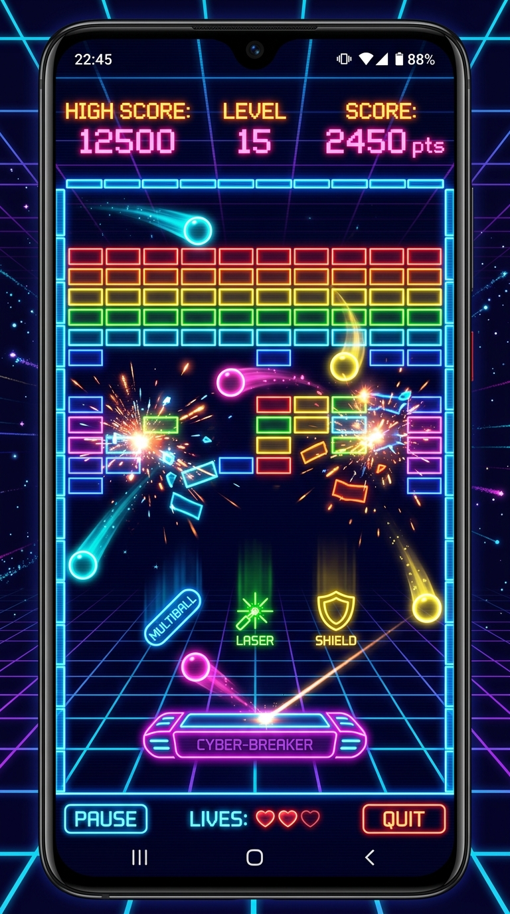
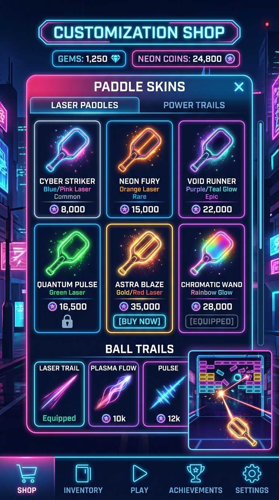

# Brick Breaker

  

A modern, action-packed retro arcade Brick Breaker game built with Kotlin, Jetpack Compose, and custom SurfaceView rendering.

---

## 🎮 Gameplay Preview

  
  &nbsp;&nbsp;&nbsp;&nbsp;
  

---

## ✨ Features

- **Arcade Physics Engine**: Dynamic ball collisions, paddle spins, and smooth 60 FPS loop.
- **Power-Ups & Lasers**: Multi-ball, laser blasters, paddle expansion, explosive bricks, and extra lives.
- **Shop & Customization**: Unlockable paddle skins, trail effects, and custom brick themes.
- **Haptic & Audio FX**: Particle explosion systems, sound synthesis, and tactile vibrations.
- **Progressive Levels**: Multiple handcrafted levels with increasing challenges and obstacle bricks.

---

## 🛠️ Tech Stack

- **Language**: Kotlin
- **UI Framework**: Jetpack Compose (Material 3)
- **Architecture**: MVVM with Kotlin Flow & StateFlow
- **Rendering**: Custom Hardware-Accelerated Canvas & TextureView
- **Build System**: Gradle (Kotlin DSL)

---

## 🚀 Building & Running

1. Open the project in **Android Studio**.
2. Sync the project with Gradle files.
3. Select an emulator or physical device running Android 7.0 (API 24) or higher.
4. Click **Run** (`Shift + F10`).
